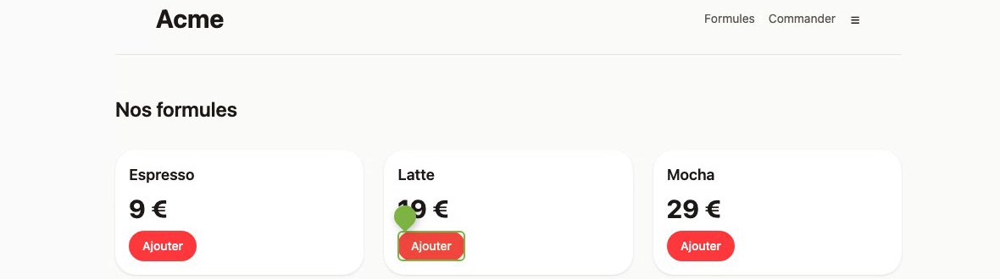
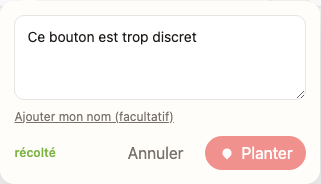

# 🍓 Fruitback

[](https://github.com/sakuga-software/fruitback/actions/workflows/ci.yml)
[](#licence)

**Visual feedback on a live site, without a backend to host.**

A client opens their staging site, clicks the element that bothers them, types a note. It lands as a
triaged issue carrying the CSS selector, the React component and the source file behind that element.
When they come back to the page, their pins are still there, coloured by the issue's status:
🌱 seeded → 🍏 green → 🍊 ripening → 🍓 ripe.



The guides are on **[sakuga-software.github.io/fruitback](https://sakuga-software.github.io/fruitback/)**,
and they are the files in [docs/](docs/).

**Fruitback runs no service that holds your feedback.** It lands in the tracker your team already
uses — or, with `FRUITBACK_STORE=sqlite`, in a file on a volume you own. No database of ours, no
dashboard of ours, no account to create anywhere.

**It comes in three modes, and which one you want is the first thing to settle.** They differ on what
the site has to ship: **public**, where the site embeds the widget and every visitor can leave a
note; **private**, where the site embeds nothing and a browser extension puts the widget on it for
one reviewer; and **team**, where the site embeds a dormant widget that wakes up for a reviewer the
extension has signed in. One page each way — [docs/modes.md](docs/modes.md).

## Install, in public mode

Two lines on a site with no build step. `client` is the name this site reports under, and `endpoint`
is **your own worker** — the piece that holds the tracker's API key, because that key cannot ship in
client-side JavaScript. It is one container: [docs/self-hosting.md](docs/self-hosting.md).

The other two modes need the same worker and a browser extension on top; the reviewer's side of both
is [docs/reviewing.md](docs/reviewing.md).

```html
<script
  src="https://cdn.acme.dev/fruitback.iife.js"
  data-fruitback-endpoint="https://feedback.acme.dev"
  data-fruitback-client="acme"
  defer
></script>
```

Or as an import, mounted after your app has rendered the elements it points at:

```ts
import { init } from 'fruitback';

const widget = init({ endpoint: 'https://feedback.acme.dev', clientId: 'acme' });
```

> **The packages are not on npm yet.** The lines above are the shape of the install, not something
> that resolves today. The worker image _is_ published — see [docs/self-hosting.md](docs/self-hosting.md).

The worker is **three commands and one line to edit**, and none of them needs a clone of this
repository:

```bash
curl -fsSLO https://raw.githubusercontent.com/sakuga-software/fruitback/main/docker-compose.yml
curl -fsSL https://raw.githubusercontent.com/sakuga-software/fruitback/main/.env.example -o .env
# set ALLOWED_ORIGINS in .env to the site that embeds the widget
docker compose up -d --wait
```

It keeps the notes in SQLite on a Docker volume, with no account anywhere. CI runs this file from an
empty directory, plants a pin, recreates the container and reads the pin back. To update, run
`docker compose pull` first: Compose does not pull a tag that is already on the machine, and `edge`
moves on every merge.

**While this repository is private, the raw files and the image are private too.** Until then,
download the two files with the GitHub CLI, logged in with `gh auth login`, and log in to `ghcr.io`
with a token that has `read:packages` — see [docs/self-hosting.md](docs/self-hosting.md#before-you-start):

```bash
gh api repos/sakuga-software/fruitback/contents/docker-compose.yml -H 'Accept: application/vnd.github.raw' > docker-compose.yml
gh api repos/sakuga-software/fruitback/contents/.env.example -H 'Accept: application/vnd.github.raw' > .env
```

The full walk-through — Linear setup, per-client routing, identified reporters — is in
[docs/install.md](docs/install.md).



## Three ways to run it

The first question a reader has is whether their reviewers need the site to ship anything. All three
answers exist, and [docs/modes.md](docs/modes.md) is the page that picks between them.

|                                           | **Public**                            | **Private**                           | **Team**                         |
| ----------------------------------------- | ------------------------------------- | ------------------------------------- | -------------------------------- |
| The site embeds                           | the widget                            | **nothing**                           | the widget, dormant              |
| Delivered as                              | `<script>` tag or npm                 | a browser extension                   | `<script>` tag or npm            |
| Published                                 | **not yet** — build it from this repo | **not yet** — load it unpacked        | **not yet** — both of the above  |
| Who is **shown** the pins                 | every visitor                         | the reviewer who switched the site on | reviewers who are signed in      |
| Who can fetch them **with no credential** | anyone                                | anyone                                | nobody, under `authenticated`    |
| Who supplies the credential               | the host's backend, or nobody         | **nobody can**                        | the reviewer, by pairing         |
| Good for                                  | a public "report a problem"           | reviewing a client's site, invisibly  | a team reviewing its own staging |
| Built                                     | **yes**                               | **yes**, MV3 on Chromium and Firefox  | **yes**                          |

**Who may read is `read` — `FRUITBACK_READ` worker-wide, or per client in `FRUITBACK_CLIENTS` — and
the mode decides who can satisfy it.** A public-mode site can
run `read: 'authenticated'` if it mints identity tokens of its own — `init({ identityToken })` is the
seam, and the credential then lives in that site's page. **Team mode is the only one where the
reviewer supplies it and the page never holds it**, attached in the extension's background. **Private
mode can supply nothing at all**: the widget it mounts has no token and no relay, so on an
`authenticated` worker its reads answer `401`, and left at the `public` default its pins are readable
by anyone who can build the URL — it changes who is _shown_ the feedback, never who may _fetch_ it.
[docs/modes.md](docs/modes.md) is the page that lays this out. The four lines a team-mode site adds are in
[docs/install.md](docs/install.md#team-mode-dormant-until-a-reviewer-arrives); what the relay
refuses is in [SECURITY.md](SECURITY.md#what-the-extension-relays-and-what-it-refuses-to).

The extension asks for **no host permission at install**: its content scripts are registered at
runtime, per origin, when somebody switches that site on.

## Where your feedback lives

`FRUITBACK_STORE` picks the connector. It defaults to `linear`, so a deployment that sets nothing
keeps the behaviour it has. Each connector reads only its own variables — a worker on SQLite is never
asked for a Linear key — and an unknown name is refused at boot rather than quietly defaulted.

| `FRUITBACK_STORE`    | Needs                                                                                    | Runs on                          | Good for                                                                                                                                                                                 |
| -------------------- | ---------------------------------------------------------------------------------------- | -------------------------------- | ---------------------------------------------------------------------------------------------------------------------------------------------------------------------------------------- |
| `linear` _(default)_ | `LINEAR_API_KEY`, `LINEAR_TEAM_ID`                                                       | anywhere the worker runs         | A team already triaging in Linear. Dashboard, API, MCP and integrations come for free.                                                                                                   |
| `sqlite`             | `FRUITBACK_SQLITE_PATH`                                                                  | **a persistent filesystem only** | Self-hosting with no third party at all. One file on a volume.                                                                                                                           |
| `github`             | `FRUITBACK_GITHUB_APP_ID`, `FRUITBACK_GITHUB_PRIVATE_KEY`, `FRUITBACK_GITHUB_REPOSITORY` | anywhere the worker runs         | A team whose issues are already on GitHub. Three stages instead of five: `seeded` while open, `ripe` when closed as completed, `composted` when closed as not planned or as a duplicate. |
| `memory`             | nothing                                                                                  | the dev loop                     | Refused under `NODE_ENV=production`.                                                                                                                                                     |

SQLite is one file through `node:sqlite` — no dependency, no native module, and the schema migrates
itself on open, so a self-hoster starts one container rather than two. What it gives up is the
dashboard: with no tracker behind it, the pins on the page are the interface. The compose snippet,
the one-line backup and what else you trade are in
[docs/self-hosting.md](docs/self-hosting.md#storing-the-seeds-in-sqlite).

GitHub Issues signs in as a GitHub App, never with a personal token: the worker mints a token that
expires after an hour and reaches one repository. Setting up the App is in
[docs/self-hosting.md](docs/self-hosting.md#storing-the-seeds-in-github-issues). Every connector plugs
into [`apps/worker/src/store.ts`](apps/worker/src/store.ts).

## Security, and what is open by default

Fruitback puts a widget in somebody else's page and a worker in front of somebody's issue tracker.
**[SECURITY.md](SECURITY.md) says where those boundaries are**, and it is worth reading before you
deploy rather than after. Two things surprise people most often:

- **`GET /feedback` answers anyone who can build the URL**, unless you set
  `FRUITBACK_READ=authenticated`. Every note, its reporter's name and address, and the team's replies
  are readable by any visitor of the client's site — and by `curl`. The default stays open so an
  upgrade never blanks a working deployment; the boot log names every client it applies to.
- **`clientId` is asserted by the browser, never authenticated.** `origins` makes the claim checkable
  against the browser's own header — the trust level CORS gives, and no more.

It also says how to report a vulnerability.

## Documentation

|                                              |                                                                                 |
| -------------------------------------------- | ------------------------------------------------------------------------------- |
| [docs/modes.md](docs/modes.md)               | The three modes, what each protects, and which one you want                     |
| [docs/install.md](docs/install.md)           | Putting the widget on a site, end to end                                        |
| [docs/translating.md](docs/translating.md)   | Adding a language to the widget's bundle                                        |
| [docs/reviewing.md](docs/reviewing.md)       | The reviewer's side: the extension, switching a site on, pairing                |
| [docs/self-hosting.md](docs/self-hosting.md) | Running the worker: the image, the tags, a deployment                           |
| [docs/architecture.md](docs/architecture.md) | Why this shape, the seed contract, the layout, the commands                     |
| [docs/decisions/](docs/decisions/)           | Per-subject histories: what was measured, what failed first                     |
| [SECURITY.md](SECURITY.md)                   | The threat model, stated rather than implied                                    |
| [CONTRIBUTING.md](CONTRIBUTING.md)           | Running the project, what must pass, the conventions, adding a connector        |
| [CODE_OF_CONDUCT.md](CODE_OF_CONDUCT.md)     | The Contributor Covenant, and where to report a breach                          |
| [CLAUDE.md](CLAUDE.md)                       | The conventions and invariants, for anyone — human or agent — writing code here |

Work is tracked in Linear on the
[Fruitback](https://linear.app/sakuga-software/project/fruitback-ed574263d8d6) project (team SKG).

## Licence

Two licences, split where the client/server boundary is (SKG-515).

|                                                            |                   |
| ---------------------------------------------------------- | ----------------- |
| `packages/widget`, `packages/shared`, `packages/fruitback` | **MIT**           |
| `apps/worker`                                              | **AGPL-3.0-only** |

The three client-side packages are **MIT** because they are compiled into someone else's site: a
copyleft licence on code that ships inside a client's own bundle is one nobody can adopt, and the
widget is worth nothing unadopted. (They are the three meant for npm — not three that are on it; see
the install note above.) The worker is **AGPL-3.0-only** — it is the server, the only place
copyleft actually bites, so anyone who hosts a modified version publishes their modifications.
Copyright (C) 2026 Sakuga Software; the full text is in
[`apps/worker/LICENSE`](apps/worker/LICENSE).

`@fruitback/widget` compiles `react-grab` and `zod` **into** its `dist` rather than asking a client
site to install them. Both are MIT, and MIT requires their notices to travel with the code, so the
tarball ships [`THIRD-PARTY-NOTICES.md`](packages/widget/THIRD-PARTY-NOTICES.md) — checked by the
suite, not by hand. `apps/playground` is not published and not deployed; it inherits the repository's
MIT licence.
